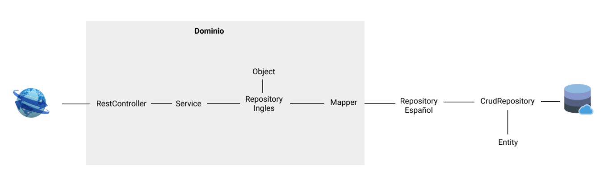

# 🛍️ platzi-market
Proyecto desarrollado en el curso de java Spring en Platzi - 2021

## 🏗️ Estructura del proyecto

## Más documentación 📖

* [Notas curso](https://www.notion.so/Curso-de-Java-Spring-af8486695fc8459ca02556366bba8070)

## Autor ✒️

* **Sebastian Pinto Becerra** - *Trabajo Inicial* - [SebastianP07](https://github.com/SebastianP07)
* **Sebastian Pinto Becerra** - *Documentación* -  [SebastianP07](https://github.com/SebastianP07)

También puedes mirar la lista de todos los [contribuyentes](https://github.com/SebastianP07/ServiciosREST/graphs/contributors) quíenes han participado en este proyecto.

---
⌨️ por [SebastianP07](https://github.com/SebastianP07) ☕
